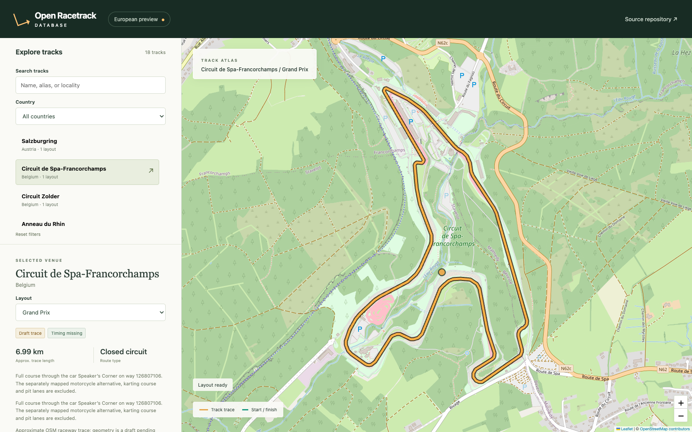

# Open Racetrack Database

Browse circuits, compare layouts, and download their geographic traces as GeoJSON. Open Racetrack Database is a small static website backed by versioned JSON, with source records for every course. Start and finish lines appear when timing evidence is available.



*Actual viewer screenshot. Course trace © OpenStreetMap contributors, ODbL 1.0. The screenshot uses public data and includes no private timing overlay.*

## European preview

The preview now covers **18 venues and 27 layouts across seven EU countries**, including 15 venues added after the initial five-layout review build.

New venues: Hockenheimring, Spa-Francorchamps, Zolder, Zandvoort, Assen, Monza, Imola, Misano, Mugello, Paul Ricard, Magny-Cours, Le Mans Bugatti, Barcelona-Catalunya, Jerez, and Valencia. Hockenheim, Imola, Misano, Paul Ricard, Barcelona, and Jerez have selectable alternatives.

Track traces come only from pinned OpenStreetMap source data and explicit route recipes. Every route is currently marked **draft**. The local preview displays start/finish GPS references from the maintainer's Racelogic archive, with estimated 25 m display lines. The importer reads only the start/finish XML, never CIR files, map pictures, or track boundaries. Private timing stays outside the reusable database, downloads, and production build.

The original pilot still has unresolved data: Nürburgring's GP preview follows the mapped Sprint configuration, Anneau's nominal layout lengths need confirmation, and Nordschleife Bridge to Gantry is absent. The catalogue expansion does not mark these pilot requirements complete. See [the implementation report](Docs/06-european-preview-status.md) and [contributor workflow](CONTRIBUTING.md).

## Run locally

Use Node.js 24 LTS and npm (Node 26 also works for the current preview):

```sh
npm ci
npm run import:timing -- --archive /path/to/racelogic-tracks-db.zip
npm run import:osm -- --track at-salzburgring
npm run import:osm -- --track fr-anneau-du-rhin
npm run import:osm -- --track de-nurburgring
npm run generate:data
npm run dev -- --host 0.0.0.0
```

To build and serve the production preview:

```sh
npm run build
RACETRACK_TIMING_FILE=.local/timing.json PORT=5190 npm run serve
```

Validation commands are `npm run lint`, `npm test`, and `npm run test:e2e` (the latter uses installed Google Chrome and a running preview on port 5190; override with `RACETRACK_TEST_URL`). The build validates data, checks reproducible generation, and type-checks before bundling. Imports are maintainer-only; the viewer never queries Overpass.

The preview server can expose private timing positions when started with `RACETRACK_TIMING_FILE=.local/timing.json`. The timing importer reads only `Start Finish Database/StartFinishDataBase.xml`; it does not open CIR files or track maps. Keep the generated file private. Public build output excludes `.local/`.

On the Mac Mini, the current preview is available to connected Tailscale devices at [marks-mac-mini.baboon-trench.ts.net:8445](https://marks-mac-mini.baboon-trench.ts.net:8445/). Tailscale Serve proxies to the local production preview on port 5190.

## Data and code licenses

Original application code is MIT licensed. OSM-derived database content is attributed to OpenStreetMap contributors and distributed under ODbL 1.0. Source records document each input and its limits. See [Docs/README.md](Docs/README.md) for the full specification and source rules.
