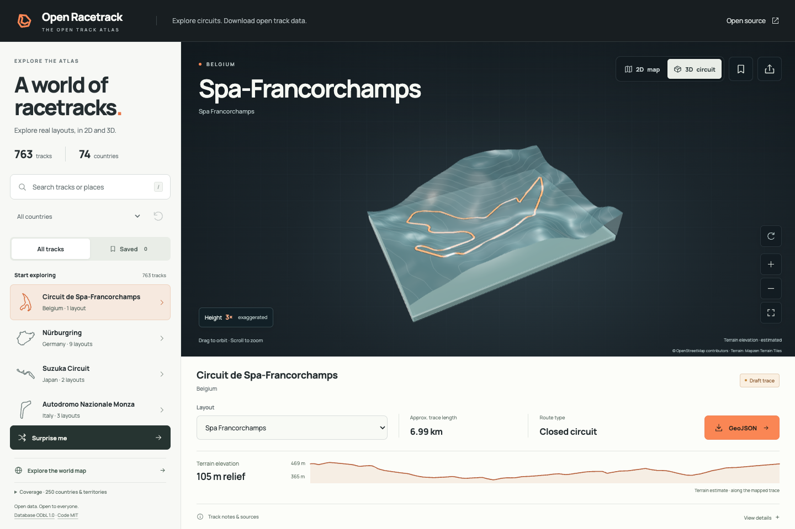

# Open Racetrack DB

Find racetracks around the world. Explore their layouts. Download geographic traces with source and license information.

[**Open the track atlas**](https://racetracks.mthracelab.com/)



*Map data © OpenStreetMap contributors. See [data licenses](DATA_LICENSE.md) for attribution and source terms.*

## Start here

1. Search for a track or country.
2. Choose a layout. Switch between the 2D map and 3D terrain view.
3. Save a favourite in your browser, or download the GeoJSON trace.

Coverage varies. Some layouts are drafts or have no trace. Terrain heights are approximate and can be exaggerated in the viewer. They are not a survey of the track surface.

## Run locally

Use Node.js 24 and npm. The repository's `.node-version` pins the runtime.

```sh
npm ci
npm run dev
```

See the [technical guide](TECHNICAL_GUIDE.md) for imports, coverage audits, data generation, and build checks. The [documentation index](Docs/README.md) describes the data contract and sources. Check [data licenses](DATA_LICENSE.md) before you reuse a trace.
