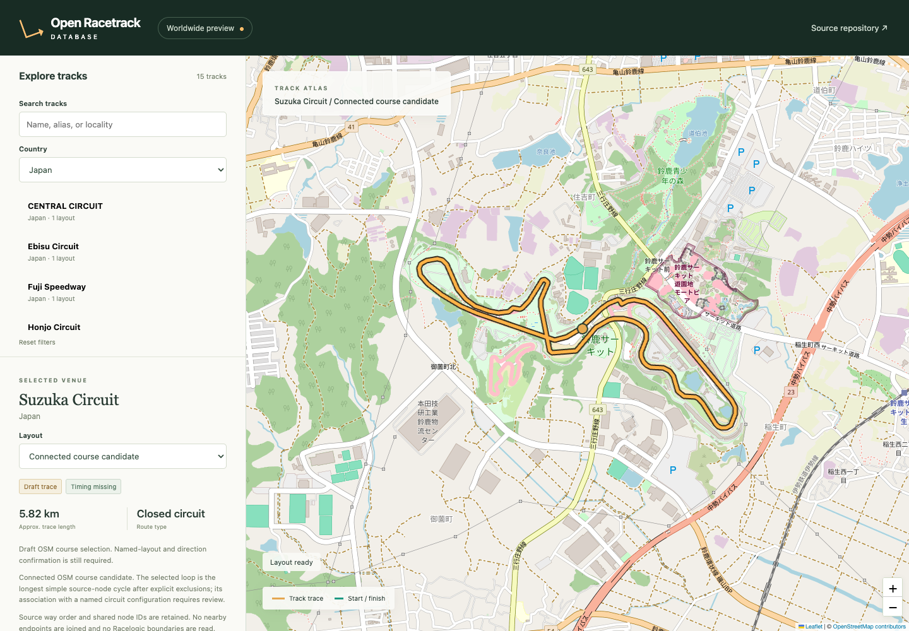
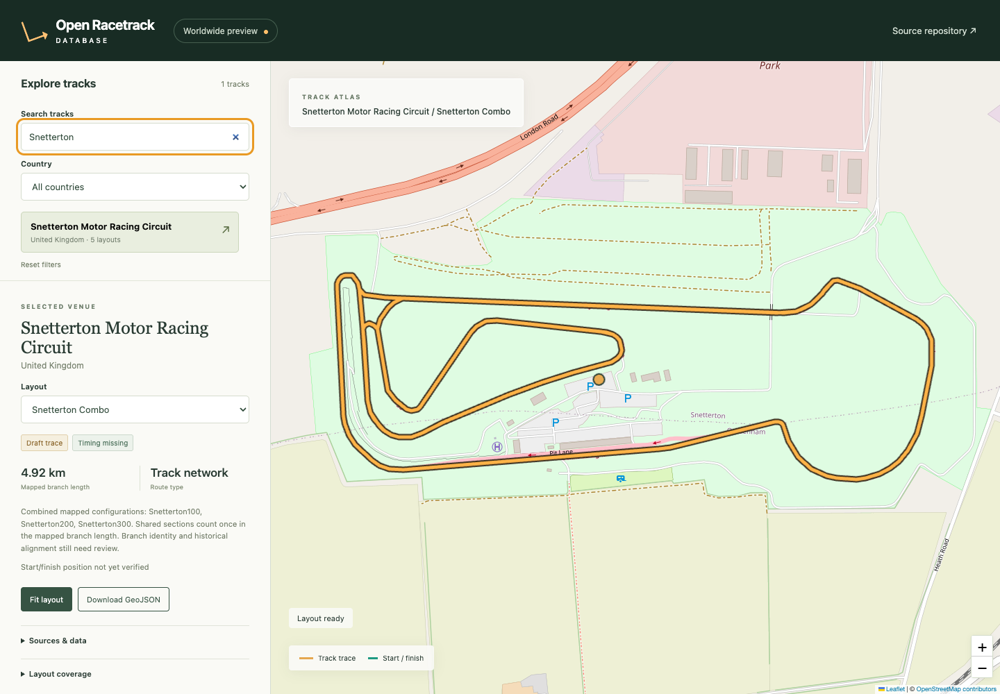

# Open Racetrack Database

Browse circuits, compare layouts, and download their geographic traces as GeoJSON. Open Racetrack Database is a small static website backed by versioned JSON, with source records for every course. Start and finish lines appear when timing evidence is available.



*Actual viewer screenshot. Course trace © OpenStreetMap contributors, ODbL 1.0. The screenshot uses public data and includes no private timing overlay.*

## Worldwide preview

The viewer contains **763 venues across 74 countries**, with every one of the **1,007 supplied layout entries** registered. Search a venue, select a layout, and download an attributed GeoJSON trace when geometry is available.

**954 supplied entries have draft course traces; 53 still need geometry.** The catalogue also retains additional independently mapped course candidates. An unavailable layout clears the map trace and has no download button. The [layout coverage report](Docs/09-layout-coverage.md) lists every entry and remaining geometry gap. The [recovery notes](Docs/10-course-recovery.md) explain which source limitations still need work.

Course coordinates come from pinned OpenStreetMap data or independently digitized reusable government aerial imagery. Explicit recipes preserve each source and its attribution. All traces remain drafts. Some configurations are hypotheses selected by timing proximity and declared course distance; they still need visual review. A length match alone does not prove a layout is correct.

The private preview uses local start/finish GPS and estimated display lines. The importer reads layout names, scalar course distances and timing GPS from a single timing XML entry. It never reads CIR files or course boundaries. A separate manual review uses layout pictures only to identify branch choices; course coordinates come from independent mapping or reusable aerial images. Private timing stays outside the public database, downloads and build.

Nürburgring has nine catalogue entries, with distinct GP and Sprint traces. All eight Paul Ricard entries have draft traces, including the two short-course chicane variants and separate training circuit. Independently mapped open courses include Pikes Peak, Osnabrück, Harewood, Gurston Down and Aintree Sprint. Some separate-gate entries still use a supporting public loop; the local timing overlay trims the preview.

## Run locally

Use Node.js 24 LTS and npm (Node 26 also works for the current preview):

```sh
npm ci
npm run dev -- --host 0.0.0.0
```

Committed data is sufficient to run the viewer. Maintainers can acquire and resume country discovery separately:

```sh
npm run discover:world
npm run expand:world
npm run generate:data
```

Worldwide discovery sends serial batches of at most 12 countries, separates results by explicit OSM country-area markers, caches sanitized snapshots, and observes Overpass retry delays. `OVERPASS_ENDPOINT` can select another provider. Expansion produces draft candidates from shared OSM node IDs. It does not verify a named layout. Inspect the recipes and source notes before promoting a draft. Worldwide courses below 500 m and routes without a closed source cycle need manual selection.

To build and serve the production preview:

```sh
npm run build
RACETRACK_TIMING_FILE=.local/timing.json PORT=5190 npm run serve
```

Validation commands are `npm run lint`, `npm test`, and `npm run test:e2e` (the latter uses installed Google Chrome and a running preview on port 5190; override with `RACETRACK_TEST_URL`). The build validates data, checks reproducible generation, and type-checks before bundling. Imports are maintainer-only; the viewer never queries Overpass.

The preview server can expose private timing positions when started with `RACETRACK_TIMING_FILE=.local/timing.json`. The timing importer reads only `Start Finish Database/StartFinishDataBase.xml`; it does not open CIR files or track maps. Keep the generated file private. Public build output excludes `.local/`.

On macOS, `npm run preview:install` copies the build and optional private timing overlay into the user's Application Support folder and installs a LaunchAgent on localhost port 5190. Run it after rebuilding to update the persistent preview. Reinstall after changing the Node installation. The overlay stays outside the copied public build.

On the Mac Mini, the current preview is available to connected Tailscale devices at [marks-mac-mini.baboon-trench.ts.net:8445](https://marks-mac-mini.baboon-trench.ts.net:8445/). Tailscale Serve proxies to the local production preview on port 5190.

## Data and code licenses

Original application code is MIT licensed. Database content is distributed under ODbL 1.0. OSM-derived courses credit OpenStreetMap contributors; independently digitized NAIP courses credit USGS, USDA and The National Map. The original NAIP imagery is public domain. Polish aerial courses credit GUGiK and Geoportal.gov.pl, whose orthoimagery is freely reusable; the source-specific identifier `LicenseRef-GUGiK-open-data` links to the provider’s reuse statement. Saxon historical aerial courses credit GeoSN under [Datenlizenz Deutschland Namensnennung 2.0](https://www.govdata.de/dl-de/by-2-0), with independently digitized centerlines marked as changed. Source records document each input and its limits. See [Docs/README.md](Docs/README.md) for the full specification and source rules.

## Layout completeness

The supplied catalogue defines the expected layout names and timing conventions. [Every entry](sources/reference/catalogue.json) points to exactly one venue and layout, including entries whose geometry is unavailable. The [coverage report](Docs/09-layout-coverage.md) counts catalogue entries and actual traces separately.

To repeat catalogue registration, independent course matching and coverage checks:

```sh
npm run audit:archive -- --archive /absolute/path/to/tracks.zip
npm run catalogue:complete -- --archive /absolute/path/to/tracks.zip
npm run generate:data
npm run recover:variants -- --archive /absolute/path/to/tracks.zip
npm run discover:circuits
npm run research:circuits -- --archive /absolute/path/to/tracks.zip
npm run recover:circuits -- --archive /absolute/path/to/tracks.zip
npm run import:roads -- --archive /absolute/path/to/tracks.zip
npm run import:selections -- --archive /absolute/path/to/tracks.zip
npm run generate:data
npm run catalogue:complete -- --archive /absolute/path/to/tracks.zip
npm run audit:layouts -- --archive /absolute/path/to/tracks.zip
npm run import:timing -- --archive /absolute/path/to/tracks.zip
npm run research:gaps -- --archive /absolute/path/to/tracks.zip
```

Country extracts must already be available for course matching. Named circuit relations add public-road geometry that raceway-only extracts omit. [Documented course identities](sources/reference/course-identifications.json) record independent operator evidence for specific distance discrepancies. [Remaining source limitations](data/layout-gap-research.json) distinguish absent geometry, disconnected ways, ambiguous branches and unresolved distances. Only unique, connected source cycles that pass conservative timing and distance checks become draft hypotheses. Unresolved branches and missing source sections remain in the gap list. No trace is synthesized to make the counts match. The [archive filename audit](sources/reference/archive-inventory.json) reconciles six reviewed alternate filenames using identical file fingerprints and flags 18 remaining names for alias or configuration reconciliation; filename matches do not prove route equivalence.

Historical configurations can use independent OSM snapshots from before a circuit changed. Acquire a bounded venue network with `npm run discover:network -- --slug venue-2020 --bbox south,west,north,east --date 2020-01-01T00:00:00Z --raceways-only`. Bounds must come from independent venue evidence. Omit `--raceways-only` when public-road sections are needed. Add `--airfields` to include independently mapped runway and taxiway centrelines for airfield courses; area outlines remain excluded. Use `--track-lines` to research line features tagged as tracks as well as roads, with each course still requiring separate identification. The helper sanitizes and pins the response, respects server retry intervals and reuses its cache. It does not choose a layout.

For an incomplete public-road relation, `npm run discover:relation-network -- --slug venue-neighborhood --relation 12345` acquires independently mapped roads adjoining its open endpoints. The snapshot retains exact source nodes and versions. Acquiring those roads does not establish the course route; branch choices still require review and a continuous source-node recipe.

The [selection manifest](sources/reference/course-selections.json) records reviewed branch choices and distance discrepancies. Its importer checks exact source versions, shared node joins and private timing proximity before generating a draft. Identical overlapping source paths count once during route search; different branches remain separate. Tagged pit lanes cannot become course traces.



Aggregate “Combo” configurations and explicitly reviewed configuration sets use schema 2 GeoJSON networks of independently identified course paths. The viewer labels them **Track network** and displays the length of unique mapped branches. It preserves disconnected components without adding joining lines. Regular driving routes retain schema 1. [Network selections](sources/reference/course-network-selections.json) pin their component recipes and require branch-identification review. A general venue entry without an aggregate name additionally requires a public identification reference for every named component; it cannot become a network by default. Regenerate them with `npm run import:networks -- --archive /absolute/path/to/archive.zip` before the regular data generation and coverage audit.
